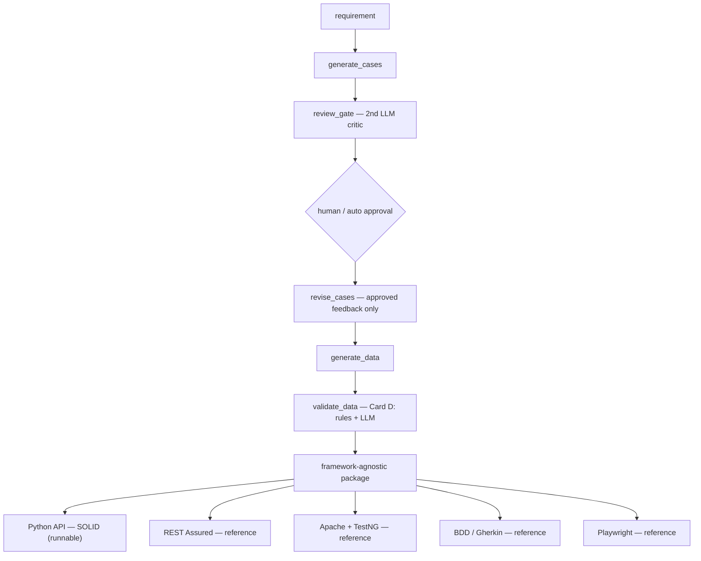

# Architecture & Design Decisions

A short tour of *why* this is built the way it is. The code is the *what*; this is the *why*.

## The shape

*(GitHub renders the Mermaid block above as a diagram. It is diagram-as-code — versioned and
diffable like the rest of the repo.)*

## Decisions

1. **Orchestrated pipeline, not an autonomous agent — by choice.** It coordinates generation
   into one flow. A fully autonomous agent that also *runs* tests and self-iterates is a
   staged roadmap item: you don't give a probabilistic system unsupervised execution on day one
   (governed autonomy — inspectable, testable, reversible).

2. **A validation gate at every handoff.** Orchestration without gates just makes mistakes
   travel faster. Each artifact is checked before it becomes the next stage's input.

3. **Human-in-the-loop vs auto/CI on one flag.** New features get a human approval gate at the
   review step; regression runs auto against a pre-approved policy. The checkpoint moves with
   the blast radius. The review critic is itself an LLM (it can over-correct or hallucinate),
   so a human holds the veto.

4. **Hybrid data validation (Card D).** Format, length, duplicates, ranges are deterministic —
   rules handle them (free, 100% reliable). The LLM is reserved for the one judgment call:
   genuine variety. Knowing when *not* to use AI matters as much as knowing when to.

5. **Thin core + thin adapters.** The intelligence is built once in the core; adapters are
   deterministic translators (no LLM, no re-generation). Onboarding a team's stack is a new
   adapter, not a new engine.

6. **One oracle, many stacks.** The domain oracle (`should_refund` / `is_well_formed`) is
   computed in one place and injected into every adapter, so Python, Java, Gherkin, and
   Playwright all assert against the same source of truth — no per-stack drift.

7. **Service-agnostic engine.** The runnable Python engine hardcodes no endpoint; behaviour is
   driven by a thin per-service spec (method, path, mapping, oracle). GET/POST/DELETE is a field.

8. **Oracles: a role, not a database.** For deterministic logic the oracle is code (`_cancel_oracle`);
   for lookups it is reference data (`_get_booking_oracle` checks the API response against the
   source-of-truth store). Response assertions verify what the API *said*; state verification
   confirms what it *did*.

9. **Provider-agnostic LLM layer.** The core talks to a thin `LLMClient.complete()` interface,
   not a vendor SDK. The provider is chosen by an env var (`LLM_PROVIDER`, default `anthropic`;
   `openai` supported), so the framework is not locked to one vendor — swapping providers is a
   small change in `core/llm.py` and nowhere else.

## Honest scope (named != claimed)

- **Executed live:** the Python API adapter + engine (`pytest`, all green against the mock SUT).
- **Reference (idiomatic, review-ready, run in their own environment):** REST Assured,
  Apache HttpClient + TestNG, BDD/Gherkin, Playwright.
- The framework scaffolding (`RestClient` / `TestBase`) is hand-written and stable; only the
  test layer is generated.

## A red test is a question, not a verdict

While building, an adversarial record (a null `cancel_time`) produced a `422`. Triaging it:
the API was correctly rejecting malformed input, so the red flag was an *incomplete oracle*, not
a product defect. The oracle now treats "malformed -> 4xx" as an expected outcome.
